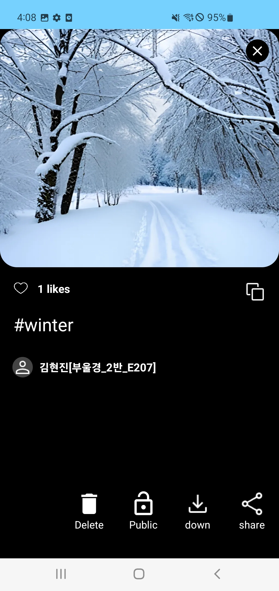
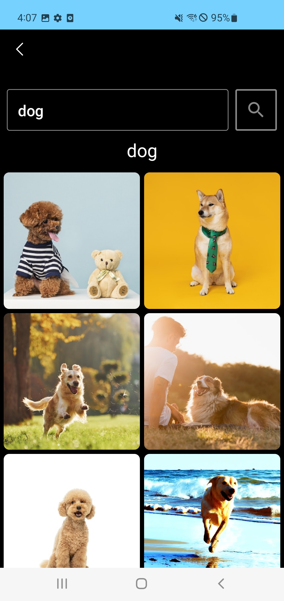
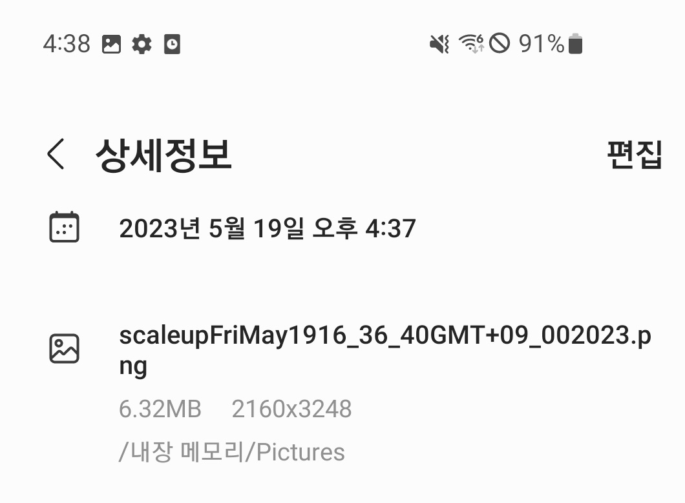

# Site

- https://home.hexa-backenders.com/

## Production

- https://defiant-headphones-545.notion.site/5e677b6e22004ab29a50c8c9cf0c3f0b

## Develop

## Backend

> Gateway

- https://dev-gateway.hexa-backenders.com/

> MSA 내부

- https://dev-gateway.hexa-backenders.com/alarm
- https://dev-gateway.hexa-backenders.com/picture
- https://dev-gateway.hexa-backenders.com/user

## Jenkins

> https://dev-jenkins.hexa-backenders.com/

## Nginx manager

> https://npm.hexa-backenders.com/

## EFK Stack

> https://kibana.hexa-backenders.com/

## Database

### Mariadb

> DEV : jdbc:mariadb://k8e104.p.ssafy.io:3506

> PROD : jdbc:mariadb://k8e104.p.ssafy.io:3406

## Architecture

> ##### Kubernetes Cluster

 

> ##### Jenkins Pipeline

 

> ##### Architecture Flow

# Funtion and UI

## Home
### Today's Pick

    

### Monthly

### FloatingButton

## Detail

## Notification
### push message
    

### in app message
    

## Search

## ProfilePage
### myworks

### likes

## Text2Image
### generation activity

### text input

### example result

## Edit
### selection

### base edit

### face swap
- 1. source

- 2. target

- 3. result

### AI Reinforcements
- one function of them (Deblur)
- 1. before

- 2. after

### Change Style
- 1. before

- 2. after

    

### Super Resolution
- 1. before

- 2. after

