# Site

- https://home.hexa-backenders.com/

## Production

- https://defiant-headphones-545.notion.site/5e677b6e22004ab29a50c8c9cf0c3f0b

## Develop

## Backend

> Gateway

- https://dev-gateway.hexa-backenders.com/

> MSA 내부

- https://dev-gateway.hexa-backenders.com/alarm
- https://dev-gateway.hexa-backenders.com/picture
- https://dev-gateway.hexa-backenders.com/user

## Jenkins

> https://dev-jenkins.hexa-backenders.com/

- ID : admin
- PW : wkdbffodzld1dnl!

## Nginx manager

> https://npm.hexa-backenders.com/

- ID : hexabackenders@gmail.com
- PW : wkdbffodzld1dnl!

## EFK Stack

> https://kibana.hexa-backenders.com/

- ID : N/A
- PW : N/A

## Database

### Mariadb

> DEV : jdbc:mariadb://k8e104.p.ssafy.io:3506

- ID : 3d6b / root
- PW : wkdbffodzld1dnl!

> PROD : jdbc:mariadb://k8e104.p.ssafy.io:3406

- ID : 3d6b / root
- PW : wkdbffodzld1dnl!

## Architecture

> ##### Kubernetes Cluster

 

> ##### Jenkins Pipeline

 

> ##### Architecture Flow

# Funtion and UI

## Home
### Today's Pick
    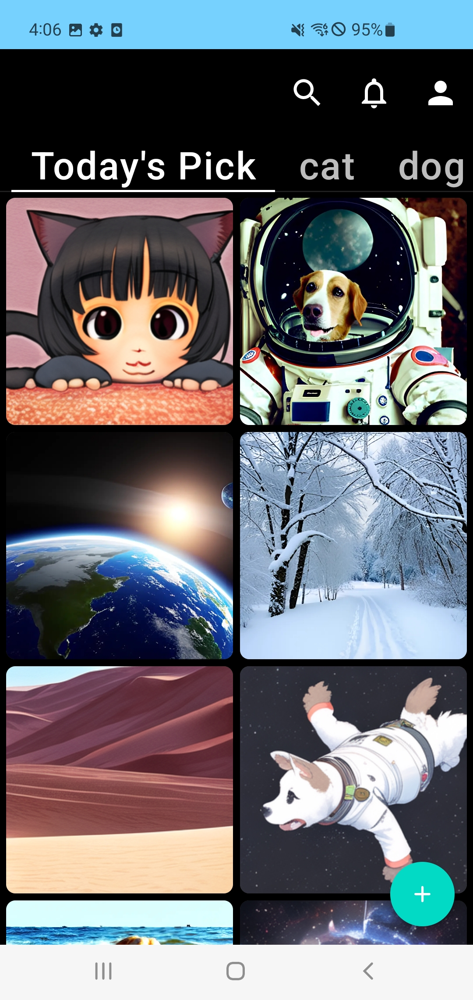

### Monthly
    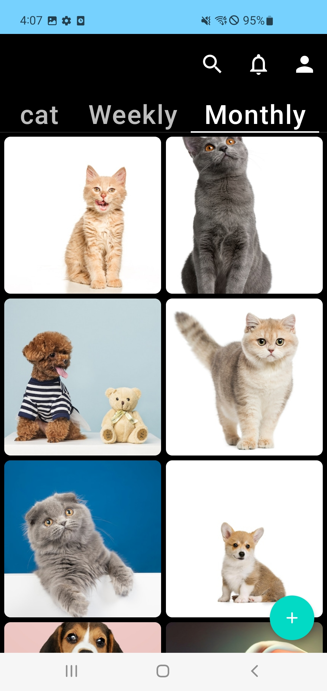

### FloatingButton
    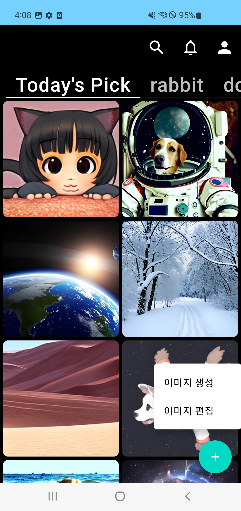

## Detail
### 

## Notification
### push message
    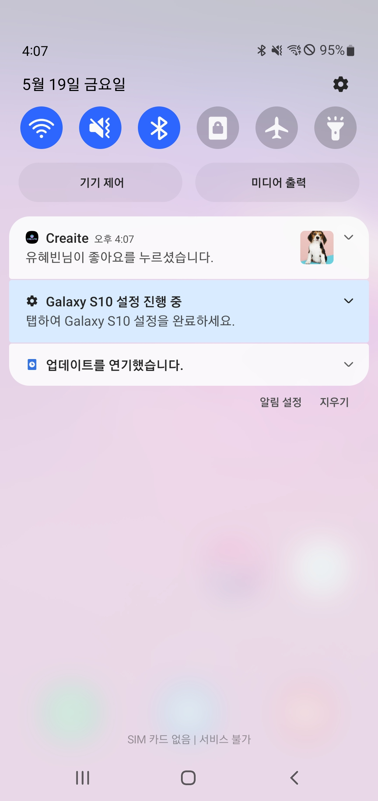

### in app message
    

## Search
### 

## ProfilePage
### myworks
    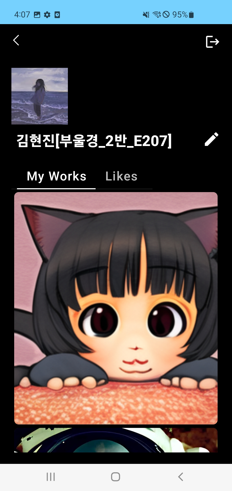

### likes
    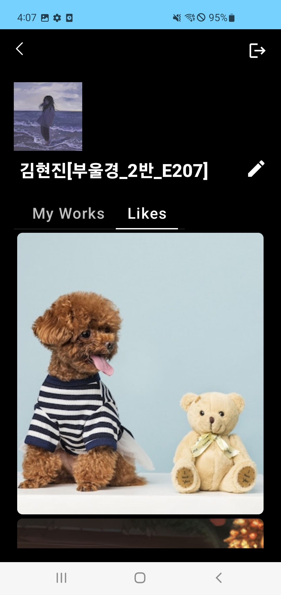

## Text2Image
### selection
    

### generation activity
    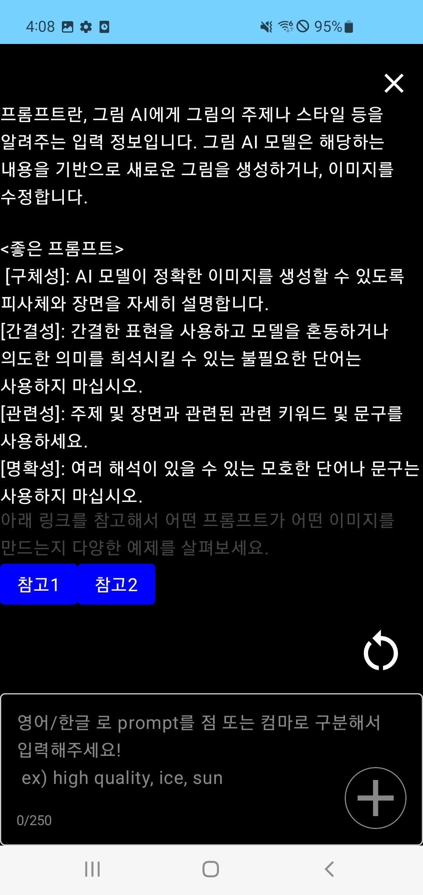

### text input
    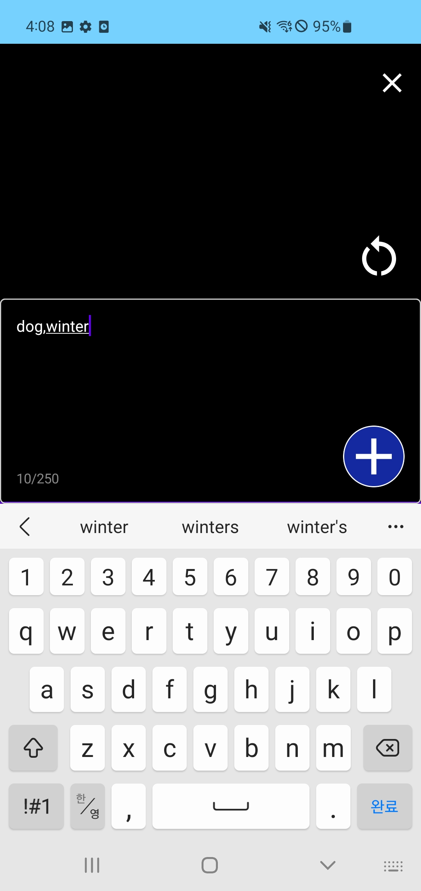

### example result
    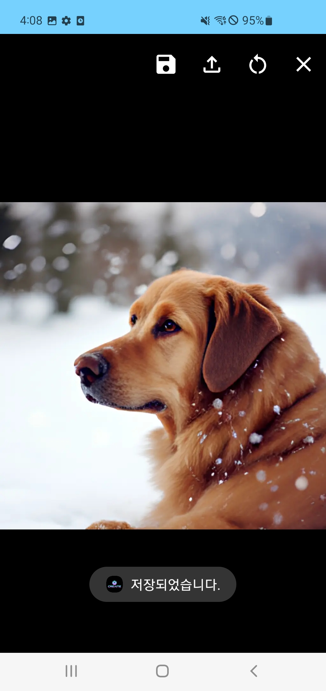

## Edit
### selection
    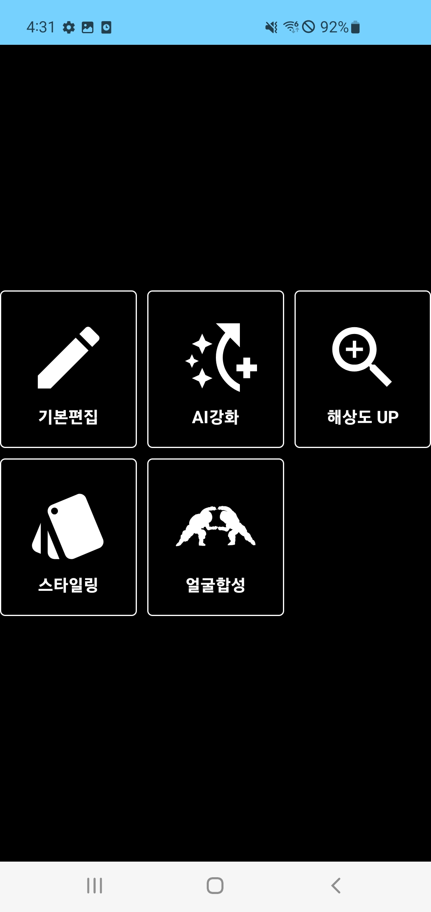

### base edit
    

### face swap
- 1. source
    

- 2. target
    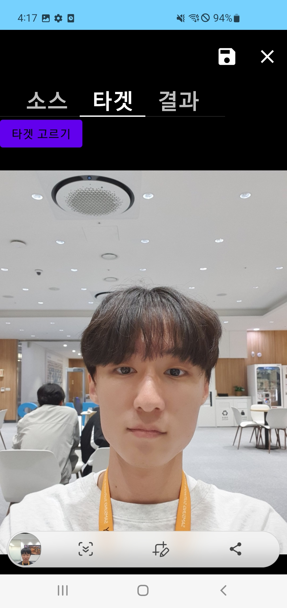

- 3. result
    

### AI Reinforcements
- one function of them (Deblur)
- 1. before
    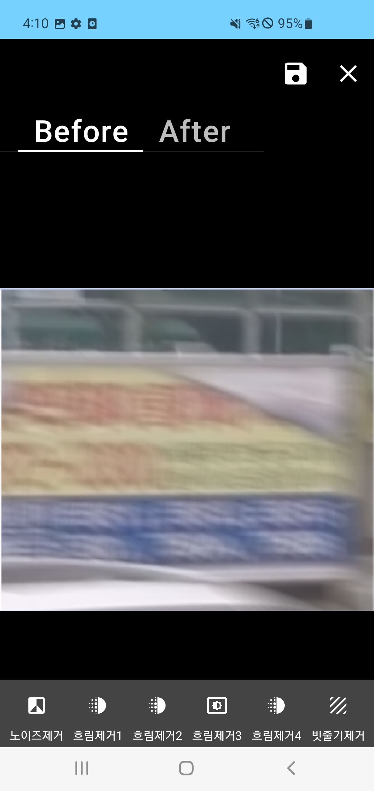

- 2. after 
    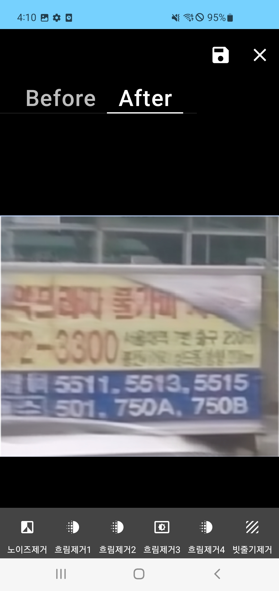

### Change Style
- 1. before
    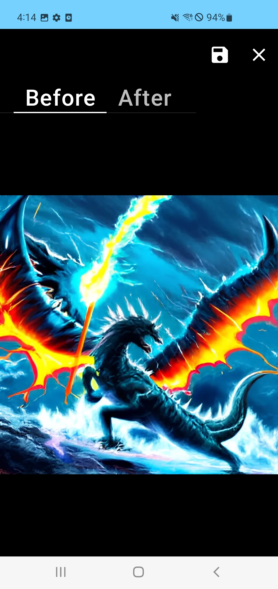

- 2. after
    

### Super Resolution
- 1. before
    
    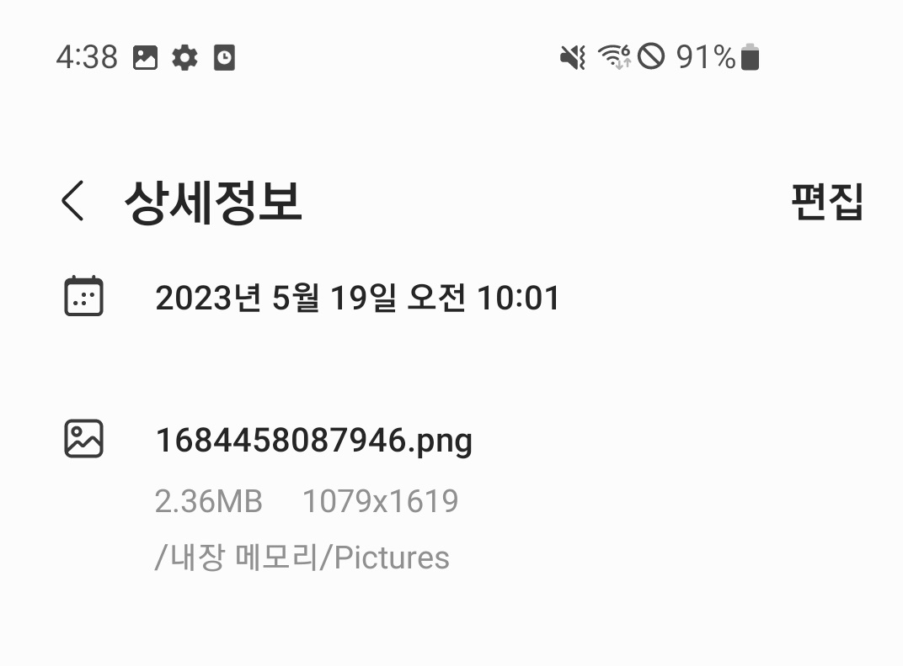

- 2. after
    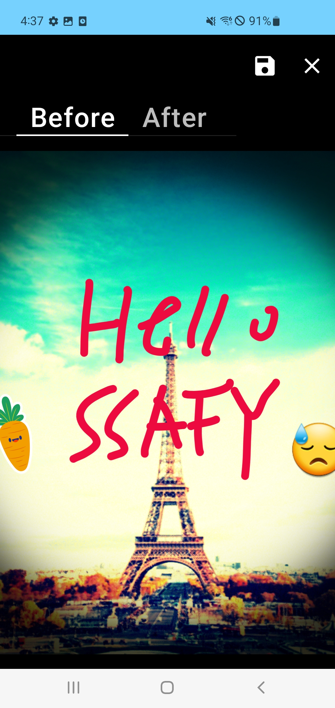
    

### Loading Screen
    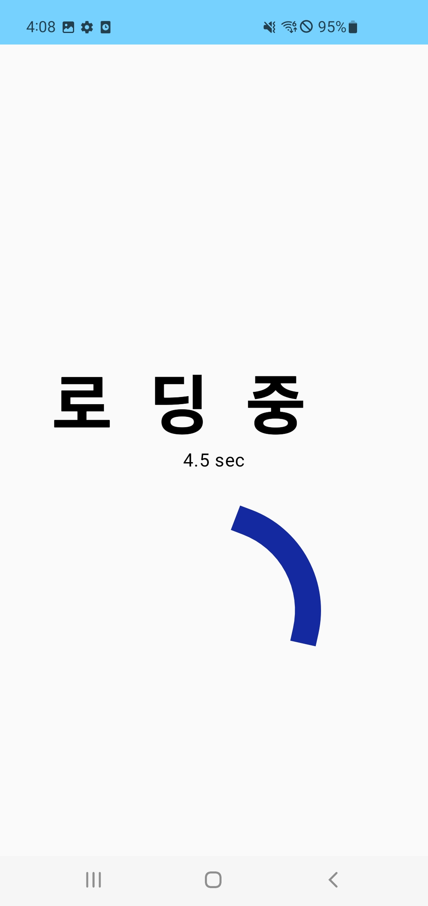
